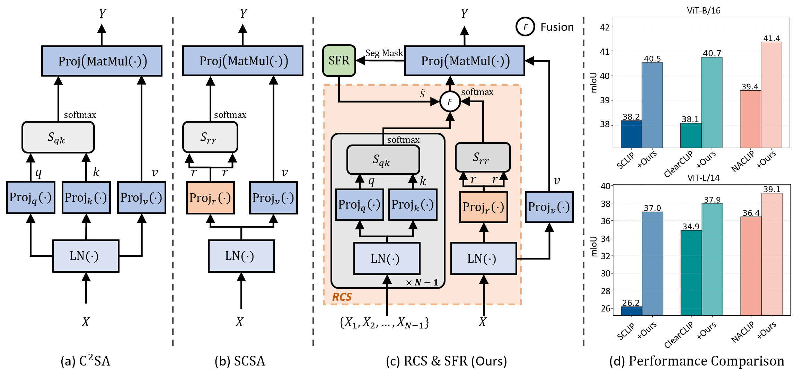
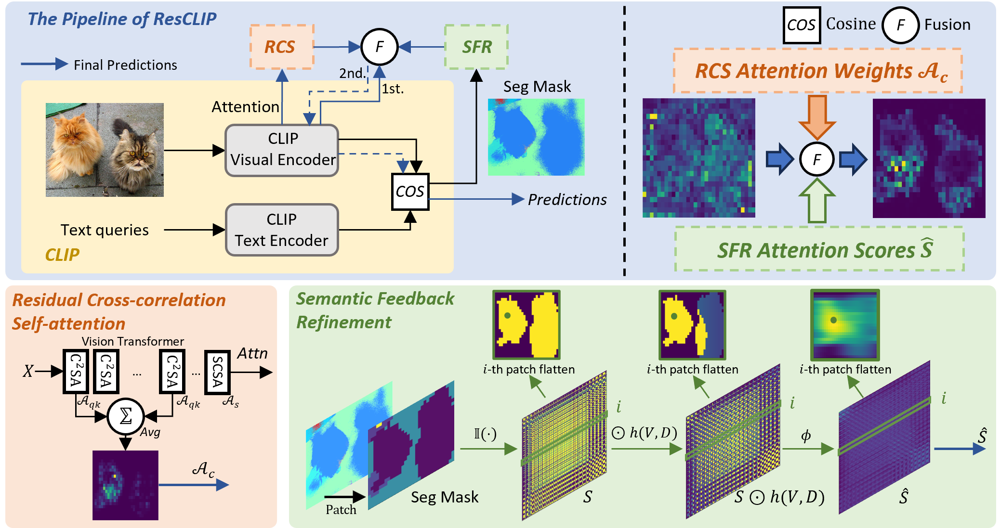
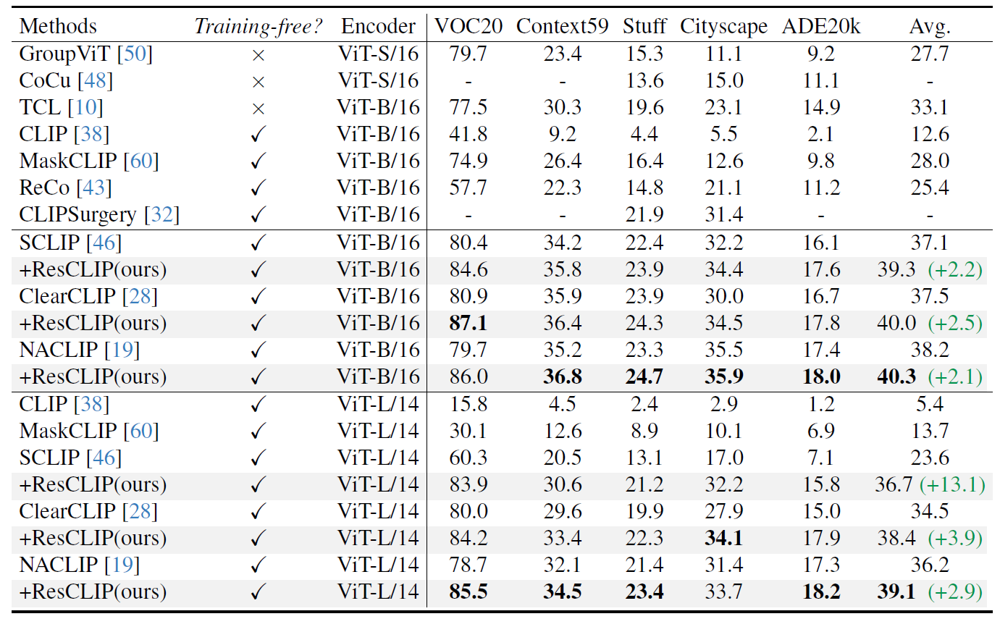
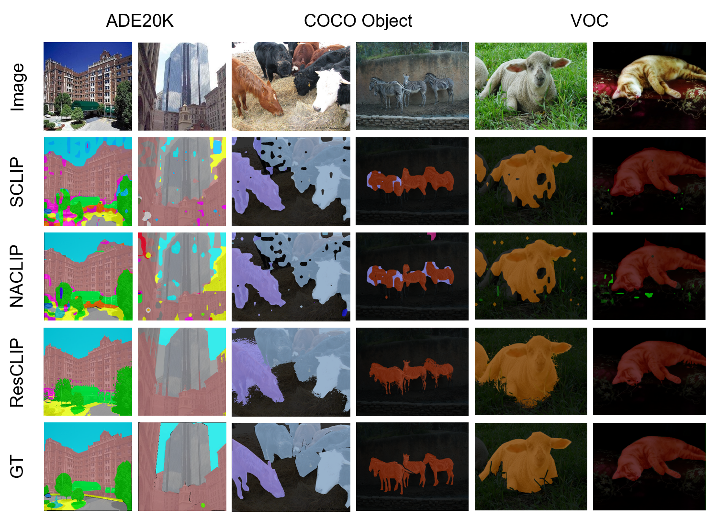

<div align="center">
<h1>ResCLIP </h1>
<h3>ResCLIP: Residual Attention for Training-free Dense Vision-language Inference</h3>
<div>
    <h4 align="center">
        <a href='https://arxiv.org/abs/2411.15851'></a>
    </h4>
</div>
</div>
    
## News
* **` Feb. 27th, 2025`**: This paper has been accepted by CVPR 2025.
* **` Nov. 23rd, 2024`**: We release paper for ResCLIP.

## Abstract
While vision-language models like CLIP have shown remarkable success in open-vocabulary tasks, their application is currently confined to image-level tasks, and they still struggle with dense predictions. Recent works often attribute such deficiency in dense predictions to the self-attention layers in the final block, and have achieved commendable results by modifying the original query-key attention to self-correlation attention, (e.g., query-query and key-key attention). However, these methods overlook the cross-correlation attention (query-key) properties, which capture the rich spatial correspondence. In this paper, we reveal that the cross-correlation of the self-attention in CLIP's non-final layers also exhibits localization properties. Therefore, we propose the Residual Cross-correlation Self-attention (RCS) module, which leverages the cross-correlation self-attention from intermediate layers to remold the attention in the final block. The RCS module effectively reorganizes spatial information, unleashing the localization potential within CLIP for dense vision-language inference. Furthermore, to enhance the focus on regions of the same categories and local consistency, we propose the Semantic Feedback Refinement (SFR) module, which utilizes semantic segmentation maps to further adjust the attention scores. By integrating these two strategies, our method, termed **ResCLIP**, can be easily incorporated into existing approaches as a plug-and-play module, significantly boosting their performance in dense vision-language inference. Extensive experiments across multiple standard benchmarks demonstrate that our method surpasses state-of-the-art training-free methods, validating the effectiveness of the proposed approach.
For more information, please refer to our [paper](https://arxiv.org/abs/2411.15851).

<p align="center">
  
</p>

<p align="center">
  
</p>

## Main Results

<p align="center">
  
</p>

<p align="center">
  
</p>

<p align="center">
  
</p>


## Getting Started
### Installation

**Step 1: Clone ResCLIP Repository:**

```bash
git clone https://github.com/yvhangyang/ResCLIP.git
cd ResCLIP
```

**Step 2: Environment Setup:**

Create and activate a new conda environment.

```bash
conda create -n ResCLIP
conda activate ResCLIP
```

**Step 3: Install Dependencies:**

To run ResCLIP, please install the following packages. We used `Python 3.9` in our experiments.

```
pip install torch==1.10.1+cu111 torchvision==0.11.2+cu111 -f https://download.pytorch.org/whl/cu111/torch_stable.html
pip install openmim
mim install mmcv==2.0.1 mmengine==0.8.4 mmsegmentation==1.1.1
pip install ftfy regex numpy==1.26 yapf==0.40.1
```

### Quick Start

#### Datasets Preparation

Please follow the [MMSeg data preparation document](https://github.com/open-mmlab/mmsegmentation/blob/main/docs/en/user_guides/2_dataset_prepare.md) to download and pre-process the datasets including PASCAL VOC, PASCAL Context, Cityscapes, ADE20k, COCO Object and COCO-Stuff164k.
The COCO-Object dataset can be converted from COCO-Stuff164k by executing the following command:

```
python ./datasets/cvt_coco_object.py PATH_TO_COCO_STUFF164K -o PATH_TO_COCO_OBJECT
```

**Remember to modify the dataset paths (`data_root`) in the config files in** `./configs/`.

####  Evaluation

To evaluate our approach on a single benchmark, run the following command:

```bash
python eval.py --config ./config/cfg_DATASET.py --workdir YOUR_WORK_DIR
```

or eval on all datasets:

```
bash test_all.sh {arch} {attn} {gaussian_std} {gpu} {log_path}
```

Values of `wo_resi` for `{arch}`, and `resclip` for `{attn}` represent our method.
For example, to reproduce the main results, run:

```
bash test_all.sh wo_resi resclip 5 {gpu} {log_path}
```

#### Demo


```bash
python demo.py
```

## Acknowledgment

This project is based on [NACLIP](https://github.com/sinahmr/NACLIP), [SCLIP](https://github.com/wangf3014/SCLIP), [ClearCLIP](https://github.com/mc-lan/ClearCLIP), [CLIP](https://github.com/openai/CLIP) and [OpenCLIP](https://github.com/mlfoundations/open_clip). Thanks for their excellent works.


## Citation

If you find this project useful, please consider citing:

```bibtex
@inproceedings{yang2025resclip,
  title={ResCLIP: Residual Attention for Training-free Dense Vision-language Inference},
  author={Yang, Yuhang and Deng, Jinhong and Li, Wen and Duan, Lixin},
  booktitle={Proceedings of the Computer Vision and Pattern Recognition Conference},
  pages={29968--29978},
  year={2025}
}
```